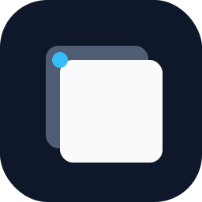

<div align="center">



# CuePane

**Name a window. Recall the whole context.**

Cross-Space Recall · CGWindowID Matching · Raycast-style Search · Dark Mode

[](https://swift.org)
[](https://developer.apple.com/macos/)
[](https://developer.apple.com/documentation/applicationservices/accessibility)

<br>

[](https://github.com/kanguk01/CuePane/releases/latest)

</div>

<br>

## Why CuePane?

macOS에서 앱 전환은 쉬워도, **정확한 작업 문맥 복귀**는 의외로 자주 깨집니다.

- 같은 앱 창이 여러 개라서 원하는 창만 바로 못 찾음
- 멀티모니터에서 같이 보던 창 조합이 한 번에 안 돌아옴
- 다른 데스크톱(Space)에 있는 작업 환경으로 바로 못 돌아감
- Stage Manager나 일반 창 전환에서 작업 흐름이 자꾸 끊김

CuePane은 여기에 집중합니다.

- **앵커 저장** -- 현재 창에 `서버로그`, `PR 482`, `회의 참고자료` 같은 이름을 붙임
- **문맥 캡처** -- 저장 시점에 같은 모니터에 함께 보이던 창들을 같이 기억
- **빠른 복원** -- 검색창에서 이름만 치면 창 하나 또는 작업 문맥 전체를 다시 호출
- **Cross-Space 복원** -- 다른 데스크톱에 있는 창도 감지하고, 자동으로 Space 전환 후 정확한 탭을 올림
- **CGWindowID 매칭** -- 같은 앱의 다른 탭이 아닌, 저장한 바로 그 창을 정확하게 식별

## Install

### Manual

1. [최신 릴리즈](https://github.com/kanguk01/CuePane/releases/latest)에서 `CuePane.dmg` 다운로드
2. `CuePane.app`을 응용 프로그램 폴더로 드래그
3. 첫 실행 시 손쉬운 사용 권한 허용

> **요구 사항** -- macOS 14.0 (Sonoma) 이상

### Homebrew

```bash
brew tap kanguk01/cuepane
brew install --cask cuepane
```

## Features

### Window Context Recall

현재 창을 앵커로 저장하면, 같은 모니터에 함께 떠 있던 일반 창들이 문맥으로 저장됩니다.

예시 -- `서버로그` 앵커 저장 시:

| 창 | 역할 |
|-----|------|
| Terminal `서버로그` | 앵커 (이름 붙인 기준 창) |
| Slack | 문맥 |
| 브라우저 `운영 대시보드` | 문맥 |

나중에 `서버로그`를 검색하면 위 문맥을 한 번에 다시 호출합니다.

### Cross-Space Recall

다른 데스크톱(Space)에 있는 창도 자동으로 감지합니다.

- **같은 앱이 현재 Space에 없으면** -- 자동 Space 전환 후 정확한 창 활성화
- **같은 앱이 현재 Space에 있으면** -- 키보드 시뮬레이션(Ctrl+숫자)으로 타겟 Space 직접 이동
- **CGWindowID 기반 매칭** -- 같은 앱의 다른 탭이 아닌, 저장한 정확한 창을 식별

### Raycast-style Search

`⌘⇧Space`로 Spotlight 스타일 검색 오버레이:

- 방향키(↑↓)로 결과 탐색, Enter로 즉시 복원
- 호버 시 인라인 액션 버튼 (즐겨찾기, 수정, 삭제)
- 우클릭 컨텍스트 메뉴로 전체 액션 접근
- 토스트 피드백 (저장/복원/삭제 시 시각적 확인)

### Favorites & Recents

- 자주 쓰는 앵커를 즐겨찾기로 상단 고정
- 마지막으로 열었던 작업 문맥을 메뉴바에서 바로 다시 열기
- 실행 횟수와 최근 사용 시각 추적

### Auto Expiration

설정에서 앵커 자동 정리 기간을 지정할 수 있습니다 (7일 / 30일 / 90일).

### Import / Export

앵커를 JSON으로 내보내고 다시 가져올 수 있습니다.

- 다른 맥에 옮기기
- 백업용 보관
- 실험 후 복원

## Keyboard Shortcuts

| Shortcut | Action |
|----------|--------|
| `⌘⇧Space` | 검색 오버레이 열기 |
| `⌘⇧N` | 현재 창 이름 붙이기 |
| `↑` `↓` | 검색 결과 탐색 |
| `Enter` | 선택 항목 문맥 복원 |
| `Esc` | 검색 / 이름 패널 닫기 |

## Permissions

CuePane은 macOS **손쉬운 사용** 권한을 사용합니다.

이 권한이 있어야:

- 현재 보이는 창을 열거하고
- 특정 창을 앞으로 가져오고
- 창 위치를 현재 디스플레이로 이동할 수 있습니다

> Cross-Space 전환 기능을 사용하려면 **시스템 설정 > 키보드 > 키보드 단축키 > Mission Control**에서 "데스크탑 X로 전환" 단축키를 활성화하세요.

<details>
<summary><h2>Packaging</h2></summary>

```bash
./scripts/build_dmg.sh
```

DMG는 `dist/CuePane.dmg`에 생성됩니다.

</details>

<details>
<summary><h2>Architecture</h2></summary>

```text
Sources/CuePane/
├── App/            # AppDelegate, CuePaneApp
├── Domain/         # Models, RestoreModels
├── Features/
│   ├── MenuBar/    # 메뉴바 팝오버
│   ├── Onboarding/ # 첫 실행 가이드
│   ├── Search/     # 검색 오버레이, 이름 붙이기
│   └── Settings/   # 설정 (자동 실행, 만료, 제외 앱)
├── Services/       # AppModel, WindowCatalog, RecallCoordinator
└── Support/        # UI 컴포넌트, 아이콘
```

| 서비스 | 역할 |
|--------|------|
| `WindowCatalogService` | AX + CGWindowList 기반 창 열거, 이동, 포커스, Cross-Space 감지 |
| `ContextCaptureService` | 앵커와 같은 모니터 문맥을 CGWindowID 포함하여 저장 |
| `RecallCoordinator` | CGWindowID 우선 매칭, Cross-Space 감지, Space 전환 조율 |
| `AnchorStore` | 로컬 JSON 저장소, 가져오기/내보내기 |
| `AppModel` | 검색, 즐겨찾기, 토스트, 빠른 재호출 흐름 조율 |
| `GlobalHotKeyManager` | Carbon 핫키 + AX 포커스 스냅샷 캡처 |

</details>

<details>
<summary><h2>Support</h2></summary>

CuePane이 유용하셨다면 커피 한 잔 사주세요 :)

<div align="center">

<br>
<sub>Toss로 후원하기</sub>
</div>

</details>

## License

Private -- All rights reserved.
